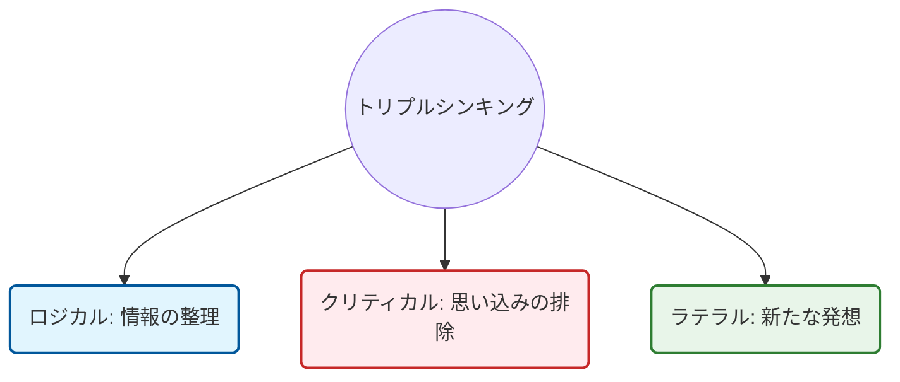

# 🧠 ビジネス思考法＆統合ワークフロー実践MOC

VUCA・DXの時代において、単なる情報や知識は容易にコモディティ化します。持続的な価値を生み出すためには、これらを組織や個人の「独自の知恵」へと昇華させる**再現性の高い思考OS（方法論）**と、それを支える**実践的な道具（フレームワーク）**の統合が不可欠です。

このノートは、主要なビジネス思考OSの分類、それに対応する実践フレームワーク、そしてそれらを地続きで繋いだ「5フェーズの統合ワークフロー」をObsidianにストックし、いつでも実務で引き出せるように体系化したものです。

---

## 🗺️ 1. ビジネス思考法 4カテゴリー・10大体系マッピング

ビジネスにおける思考法は、情報や知識を独自の価値に変換するための知的OSであり、その役割に応じて4つのカテゴリー、10種類に分類されます。

| 思考法のカテゴリー | 該当する思考法 | 主な定義・役割 | 当てはめるべき実践フレームワーク |
| :--- | :--- | :--- | :--- |
| **カテゴリー1**<br>適切な前提を置く | **論点思考（イシュー思考）** | 「今、この局面で真に解くべき問題（イシュー）」を見極め、設定する。 | ・**論点ツリー（イシューツリー）**<br>・優先順位マトリクス |
| **カテゴリー2**<br>多角的な発散と<br>ユニークな仮説の導出 | **仮説思考** | 手元にある限られた情報から「最も可能性の高い仮の答え」を先に置いて逆算する。 | ・**空・雨・傘**<br>・ストーリーボード（ストーリーライン） |
| | **批判的思考<br>（クリティカルシンキング）** | 前提や通説を無批判に受け入れず「本当にそうか？」と問い直し、思考の偏りを排除する。 | ・**プロコン分析（Pros & Cons）**<br>・なぜなぜ分析（5 Whys）<br>・事実と意見の2軸整理 |
| | **水平思考<br>（ラテラルシンキング）** | 固定概念や過去の成功体験にとらわれず、自由な発想で新しいアイデアや解決策を生み出す。 | ・**SCAMPER（9つの問い）**<br>・両極端スイング |
| | **コンセプチュアル思考** | 複雑な個別事象から共通項（本質）を抽出し、普遍的な概念として構造的に捉える。 | ・**$\pi$（パイ）の字思考プロセス**<br>（抽象化 $\rightarrow$ 概念化 $\rightarrow$ 具体化） |
| | **シックスハット思考** | 異なる視点（6色の帽子）を意図的に全員で被り分け、多角的な議論と合意を高速化する。 | ・**6色ハット並行思考プログラム** |
| | **アート思考** | 他者起点（アウトサイド・イン）ではなく、創作者自身の「内発的動機・独自の美意識」を起点に価値を創る。 | ・**インサイド・アウトの自己問いかけマップ** |
| **カテゴリー3**<br>仮説の絞り込みと<br>厳密な検証 | **論理的思考<br>（ロジカルシンキング）** | 物事を筋道立てて体系的に整理し、相手に分かりやすく説明する。 | ・**ロジックツリー**<br>・**MECE分類**<br>・**ピラミッドストラクチャー** |
| | **システム思考** | 課題を「つながり・循環」として捉え、表面的な対症療法ではなく構造的な根本解決を目指す。 | ・**氷山モデル（4階層）**<br>・**因果ループ図（自己強化R／バランスB）** |
| **カテゴリー4**<br>応用による現実の解決 | **問題解決思考** | 上記の各種思考法を総合的に応用し、理想と現実のギャップを埋める具体的な施策を打つ。 | ・**問題解決の8ステップ**<br>・PDCA / OODAループ |

---

## 🤝 2. トリプルシンキング（論理・批判・水平）の協調と欠落の罠

ビジネスで最も基本となる思考OSは、**ロジカル・クリティカル・ラテラル**の3つであり、これらは互いの死角を補う「トリプルシンキング」の関係にあります。いずれか一つが欠落すると、組織は以下の「認知的機能不全」に陥ります。



### 🚫 認知的機能不全の3シナリオ
1. **【クリティカル（批判）の欠落】 $\rightarrow$ 外の論理の構築（前例踏襲・手段の目的化）**
   * ロジックは通っておりアイデアもあるが、「そもそもその前提は正しいのか？」を疑わないため、的外れなイシューを美しく解決してしまう罠。
2. **【ラテラル（水平）の欠落】 $\rightarrow$ 空想と不実行（粗探し・思考停止）**
   * 論理的に整理し、前提を疑うことまではできるが、代替となるクリエイティブな「それ以外」の選択肢が出せず、批判だけで終わる罠。
3. **【ロジカル（論理）の欠落】 $\rightarrow$ 実行不可能なアイデアの羅列（空中分解）**
   * 斬新なアイデア（ラテラル）を出し、前提を疑い（クリティカル）はするが、因果関係の整理や構造化（ロジカル）ができないため、実効性のある実行計画に落とし込めない罠。

---

## ⚡ 3. 意思決定を加速する「論点思考」✕「仮説思考」の最速シナジー

情報を網羅的に集めてから判断しようとする「情報コレクター」から脱却し、極限のスピードと質を両立させるBCG流のアプローチです。


*   **論点思考の4プロセス**：①論点候補の抽出 $\rightarrow$ ②解決可能性・実行容易性・効果で絞り込み $\rightarrow$ ③質問・反応・現場観察で論点を確定 $\rightarrow$ ④全体像（ロジックツリー）で鳥の目で確認。
*   **仮説思考の進化的修正**：情報が不完全な初期段階（初回MTGなど）で、直感的に「仮の結論」を置いてストーリーラインを構築。検証を「答え合わせ」ではなく、仮説をアジャイルに進化させる「学びのプロセス」として回す。

---

## 🌀 4. 複雑性と変革に向き合う「システム思考」✕「デザイン思考」

複雑に絡み合う悪循環を読み解くシステム思考と、徹底的に人間（ユーザー）に共感するデザイン思考は、相互に補完し合う強力なフレームワークです。

### 🏔️ システム思考の「氷山モデル」

目の前の「出来事」だけで判断せず、水面下の「構造」にアプローチすることで、レバレッジポイント（最小限の力で全体を変革する支点）を見つけ出します。

```
【氷山モデルの4階層】
 ＿＿＿＿＿＿＿＿＿＿＿＿＿  〜〜 水面（目に見える部分） 〜〜
 ＼   できごと (Events)  ／  ← 日々発生する単発のトラブル
  ＼＿＿＿＿＿＿＿＿＿＿／
   ＼ 行動パターン (Patterns) ／  ← 時系列の推移・繰り返される傾向
    ＼＿＿＿＿＿＿＿＿＿＿＿／
     ＼   構  造 (Structures)  ／  ← 制度、物理的要因、資源配分
      ＼＿＿＿＿＿＿＿＿＿＿＿／
       ＼ メンタルモデル (Mental Models) ／  ← 前提、信念、思い込み（最深部）
        ＼＿＿＿＿＿＿＿＿＿＿＿＿＿＿＿／
```

*   **因果ループ図（Causal Loop Diagram）**：
    *   **自己強化ループ（R）**：要因同士が同じ方向（$S$/Same）に増幅し、変化が雪だるま式に加速する循環（例：売上減少 $\rightarrow$ 販促費の削減 $\rightarrow$ 認知低下 $\rightarrow$ 売上減少の悪循環）。
    *   **バランス型ループ（B）**：要因が逆方向（$O$/Opposite）に作用し、ある目標値に収束・ブレーキをかける循環。
*   **デザイン思考（Hasso Plattner 5段階）**：
    *   ①共感（Empathize） $\rightarrow$ ②問題定義（Define） $\rightarrow$ ③概念化（Ideate） $\rightarrow$ ④試作（Prototype） $\rightarrow$ ⑤テスト（Test）
    *   システムという構造に対して「共感マップ」や「カスタマージャーニーマップ」を用いて個のインサイト（驚くべき本音）を特定します。

---

## 📐 5. コンセプチュアル思考：$\pi$（パイ）の字思考プロセス

具体的な実体と抽象的な概念を自由に行き来し、自分のなかに「理（ことわり）＝独自の意味・価値」を構築するための骨格プロセスです。

```
             ［抽象・概念・本質］
               ===============  ← ２）概念化（とらえる）
              ||             ||
              ||  ハンモック  ||  ← コンセプトを網で包む
              ||             ||
              ||             ||
              ||             ||
    １）抽象化  ||             ||  ３）具体化
   （引き抜く） ||             || （ひらく）
              ||             ||
             ===================
             ［具体・事象・経験］
```

1.  **抽象化（引き抜く）**：個別具体的な事例やヒット商品などの雑多な「事象・経験」から、共通する法則性や本質を引き抜く（「つまり、どういうことか？」を自問する）。
2.  **概念化（とらえる）**：引き抜いた本質を、自分ならではの定義や図として構造的に表現し、短い「コンセプト」に結晶化する。
3.  **具体化（ひらく）**：コンセプトを、具体的なビジネスモデル、アクションプラン、日常の「行動習慣」へと応用して現実にひらく。

---

## 🛠️ 6. 【実践編】5フェーズ統合問題解決ワークフロー

あらゆる思考OSとフレームワークを連動させて課題を解決する、アジャイルかつ強力な一連のワークフローです。

```mermaid
flowchain
%% Mermaid.jsのFlowchartで記述。Obsidianでそのままビジュアル化されます。
graph TD
    classDef phase fill:#f9f9f9,stroke:#333,stroke-width:2px;
    classDef tool fill:#fff,stroke:#01579b,stroke-width:1px;

    subgraph Phase1 [Phase 1: 問いの発見]
        P1(真の論点の特定) --> T1[氷山モデル]
        P1 --> T2[論点ツリー]
    end
    
    subgraph Phase2 [Phase 2: ユーザー共感]
        P2(インサイトの抽出) --> T3[共感マップ]
        P2 --> T4[カスタマージャーニー]
    end
    
    subgraph Phase3 [Phase 3: アイデア発散]
        P3(前提の脱構築) --> T5[ゼロベース / SCAMPER]
        P3 --> T6[シックスハット法]
    end
    
    subgraph Phase4 [Phase 4: 仮説検証]
        P4(クイック実験) --> T7[空・雨・傘]
        P4 --> T8[MVPキャンバス]
    end
    
    subgraph Phase5 [Phase 5: 実行・収束]
        P5(論理構造化と実行) --> T9[MECE / ロジックツリー]
        P5 --> T10[ピラミッドストラクチャー]
    end

    Phase1 --> Phase2 --> Phase3 --> Phase4 --> Phase5

    class Phase1,Phase2,Phase3,Phase4,Phase5 phase;
    class T1,T2,T3,T4,T5,T6,T7,T8,T9,T10 tool;
```

### 🎯 日常の思考力を鍛える「3つの自問自答」
どのような情報や直面する状況に対しても、呪文のように以下の3つを問いかけることで、思考OSは日常的にアップデートされます。
*   **「それはなぜか？（Why? / So what?）」** $\rightarrow$ ロジカル思考、原因・本質の深掘り
*   **「本当にそうか？（Is it true?）」** $\rightarrow$ クリティカル思考、思い込みの排除
*   **「それ以外は？（What else?）」** $\rightarrow$ ラテラル思考、新しい選択肢の探求
